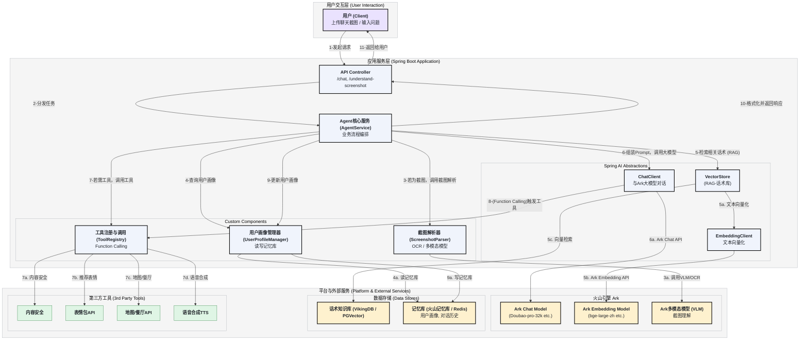
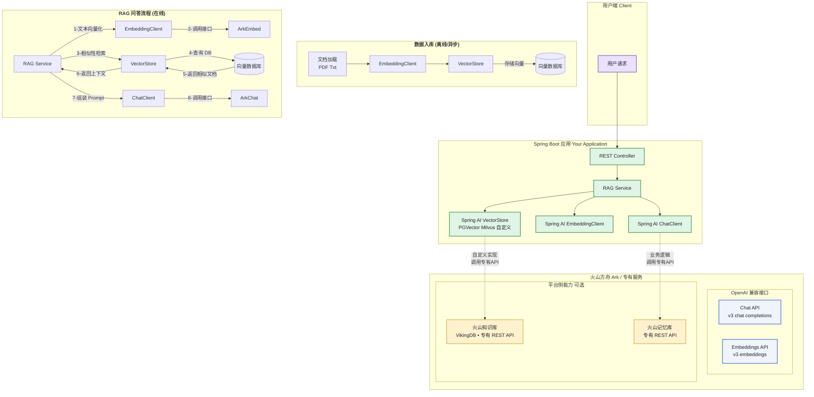

# 恋爱大师 Agent (Love Agent) - Java/Spring 技术栈项目 README

本文档旨在为“恋爱大师 Agent”项目提供全面的技术指引与落地参考。该项目基于 **Java/Spring** 技术栈，深度整合**火山引擎 Ark** 大模型服务、**RAG**、**多层记忆库**、**MCP 工具调用**与**多租户架构**，构建一个高度智能、个性化且可扩展的 AI Agent 服务。

---

## 1. 项目概览

### 1.1 项目目标

**恋爱大师 Agent** 旨在成为用户的私人情感顾问，通过先进的 AI 技术，帮助用户提升沟通技巧、化解情感难题、增进亲密关系。它不仅能理解对话上下文，还能结合用户个人特质与过往经历，提供高度定制化的、富有同理心的建议。

### 1.2 核心能力

本项目构建的 Agent 具备四大核心能力，以确保服务的智能化、个性化与安全性：

- **个性化与记忆 (Personalization & Memory)**: Agent 拥有强大的记忆系统，能够记住用户的个人画像、沟通偏好、重要事件以及与特定对象的互动历史。所有建议均基于此深度个性化，避免提供千篇一律的“罐头回复”。

- **截图理解 (Screenshot Understanding)**: 用户可直接上传聊天截图，Agent 能够通过多模态大模型（VLM）或 OCR 技术，精准理解对话内容、人物关系和情感氛围，从而给出贴切的下一步沟通策略。

- **工具增强 (Tool-Augmented)**: Agent 不仅仅是一个聊天机器人。它通过 Spring AI 的函数调用（Function Calling）能力，集成了丰富的外部工具，如：
    - **表情包推荐**: 根据语境推荐合适的表情包，打破尴尬。
    - **内容安全检测**: 确保所有交互内容合规、健康。
    - **语气风格转换**: 在“幽默搭子”与“暖心导师”等多种角色间自如切换。
    - **知识库检索 (RAG)**: 从海量的恋爱话术、沟通技巧知识库中检索最相关的内容，为建议提供理论支持。

- **合规与安全 (Compliance & Security)**: 项目在设计之初就将安全与合规置于最高优先级。通过多租户隔离、数据加密、访问控制和全面的审计日志，确保用户隐私与数据安全，满足最严格的合规要求。

---

## 2. 架构总览

本项目的架构设计遵循“分层解耦、能力复用、安全可控”的原则，充分利用 Spring AI 的抽象能力与火山引擎的平台化服务。

### 2.1 整体架构

整体架构分为四层：用户交互层、应用服务层、平台与外部服务层，以及贯穿始终的治理与运维层。



### 2.2 多租户与 MCP 架构

为了支撑大规模商用，系统在设计上原生支持多租户。通过引入 API 网关、独立的 MCP（Model Compute Platform）工具调用层，实现租户间的资源隔离、配额管理与安全审计。

```mermaid
---
config:
  theme: 'neutral'
---

flowchart TD
  linkStyle default stroke-width:2px

  classDef startend_style fill:#EAE2FE,stroke:#000000,stroke-width:2px,color:#1f2329
  classDef process_style fill:#F0F4FC,stroke:#000000,stroke-width:2px,color:#1f2329
  classDef decision_style fill:#FEF1CE,stroke:#000000,stroke-width:2px,color:#1f2329
  classDef subgraph_style fill:#f5f5f5,stroke:#bbbfc4,stroke-width:1px,color:#000000

  subgraph sg_entry ["`**用户与入口 (User & Entry)**`"]
    direction LR
    User([Multi-Tenant Users<br/>(tenantId, userId)])
  end

  subgraph sg_agent ["`**Agent 核心服务 (Spring Boot)**`"]
    Gateway["Spring Cloud Gateway<br/>(Tenant Auth & Rate Limit)"]
    Orchestrator("(Agent Orchestrator<br/>Spring AI + Function Calling)")
    Gateway --> Orchestrator
  end

  subgraph sg_mcp ["`**MCP 工具与优化层**`"]
    MCPClient["MCP Client"]
    MCPServer["MCP Server<br/>(Resource Quota)"]
    TokenTools["Token Optimization Tools<br/>(Prompt Compression, RAG, etc.)"]
    MCPClient --> MCPServer
    MCPServer --> TokenTools
  end

  subgraph sg_storage ["`**存储与中间件 (Storage & Middleware)**`"]
    subgraph sg_memory ["`**会话与记忆 (Memory)**`"]
        LocalCache["Local Cache<br/>(Caffeine)"]
        RedisCache["Redis<br/>(Hot Data)"]
        MemoryDB["Persistence<br/>(Memory Store / Knowledge Base)"]
    end
    subgraph sg_infra ["`**基础设施 (Infrastructure)**`"]
        VectorDB["Vector DB<br/>(Tenant Namespace)"]
        MQ["Message Queue<br/>(Async Persistence)"]
    end
  end

  subgraph sg_governance ["`**平台治理 (Platform Governance)**`"]
    direction LR
    Monitor["Monitoring<br/>(Metrics, Logs, Traces)"]
    Audit["Audit & DLP"]
    Security["Security<br/>(KMS, RBAC, mTLS)"]
    Resilience["Resilience<br/>(Circuit Breaker, Bulkhead)"]
  end

  %% Connections
  User --> Gateway
  Orchestrator --> MCPClient
  
  Orchestrator -->|Read/Write| LocalCache
  Orchestrator -->|Read/Write| RedisCache
  Orchestrator -->|Write| MQ
  Orchestrator -->|Read| VectorDB

  MQ -->|Async Write| MemoryDB
  MQ -->|Async Index| VectorDB

  class User startend_style
  class Gateway, Orchestrator, MCPClient, MCPServer, LocalCache, RedisCache, MemoryDB, VectorDB, MQ, Monitor, Audit, Security, Resilience process_style
  class TokenTools decision_style
  class sg_entry, sg_agent, sg_mcp, sg_storage, sg_memory, sg_infra, sg_governance subgraph_style
  
  %% Governance Connections
  Gateway -.->|Apply| Resilience
  Orchestrator -.->|Record| Monitor
  Orchestrator -.->|Enforce| Security
  Orchestrator -.->|Trigger| Audit
  MCPServer -.->|Report| Monitor
```

### 2.3 RAG 与入库/检索流程

RAG (Retrieval-Augmented Generation) 是 Agent 提供高质量建议的核心。我们通过 Spring AI 的 `VectorStore` 抽象，将“恋爱话术”等知识存储于火山 VikingDB 或其他向量数据库中。



---

## 3. 技术选型与平台能力

| 领域 | 选型 | 理由与说明 |
| :--- | :--- | :--- |
| **LLM 接入框架** | **Spring AI** | 深度整合 Spring 生态，提供 `ChatClient`, `EmbeddingClient`, `VectorStore` 等标准抽象，简化开发。 |
| **大语言模型 (LLM)** | **火山方舟 Ark Chat 服务** | 提供兼容 OpenAI 的 API (`/v3/chat/completions`)，可无缝对接到 Spring AI 的 `openai-starter`。模型可选 `Doubao-pro-32k` 等。（*注：具体模型名可能随平台更新而变化*） |
| **Embedding 模型** | **火山方舟 Ark Embedding 服务** | 同样提供兼容 OpenAI 的 API (`/v3/embeddings`)，模型可选 `bge-large-zh` 等。需确保其输出维度与向量库配置一致。 |
| **知识库 (RAG)** | **火山知识库 (VikingDB) / PGVector** | **首选火山知识库**，提供全托管的 RAG 服务。备选方案为自建 **PGVector** 或 Milvus，通过 Spring AI 的 `pgvector-store-starter` 等集成。 |
| **记忆库 (Memory)** | **火山记忆库 / Redis** | **首选火山记忆库**，用于存储长期、权威的用户画像与历史。**Redis** 作为热数据层，缓存高频用户的核心画像，提升访问速度。 |
| **截图理解 (OCR)** | **火山方舟多模态模型 / 通用 OCR** | **首选多模态模型**，直接通过 API 对图片内容进行结构化理解。备选为火山通用 OCR 服务，返回文字和坐标，由应用层进行版面分析。 |
| **内容安全** | **火山内容安全服务** | 提供 REST API，对用户输入和 Agent 输出进行涉黄、涉政、广告等风险检测，保障服务合规。 |
| **消息队列 (MQ)** | **Kafka / RocketMQ** | 用于**异步持久化**。例如，在线服务完成对话后，将记忆更新事件推入 MQ，由后台消费者服务异步写入火山记忆库/数据库，避免阻塞主流程。 |
| **缓存** | **Redis / Caffeine** | **Redis** 用于分布式缓存（如用户画像热数据、RAG 检索结果）。**Caffeine** 用于进程内缓存（如短期会话状态、配置项）。 |

---

## 4. 多租户与隔离

平台设计原生支持多租户，确保不同租户（如不同的合作渠道、不同等级的客户）之间的数据、资源和访问权限严格隔离。

- **身份与访问隔离**:
    - **`tenantId`/`userId`/`sessionId`**: 所有请求和数据处理链路都必须传递并校验 `tenantId` 和 `userId`。`sessionId` 用于标识单次会话。
    - **RBAC/ABAC**: 基于角色的访问控制（RBAC）和基于属性的访问控制（ABAC）相结合，精细化管理租户对不同功能（如工具调用、高级模型使用）和数据的访问权限。

- **基础设施与网络隔离**:
    - **Kubernetes (k8s) Namespace**: 每个租户或一组相似的租户可以部署在独立的 k8s Namespace 中，实现计算资源的逻辑隔离。
    - **NetworkPolicy**: 配置 k8s 网络策略，限制不同租户的 Pod 之间以及 Pod 与外部服务的网络访问，实现网络层隔离。
    - **mTLS**: 服务间调用启用双向 TLS (mTLS)，确保通信链路的机密性和真实性。

- **数据隔离**:
    - **数据分域与加密**: 不同租户的数据在物理存储上（如数据库表、向量库集合、对象存储 Bucket）通过 `tenantId` 进行分区或分表。所有敏感数据（如用户画像、API Key）落盘前必须使用独立的租户密钥进行加密。
    - **DLP (数据防泄露)**: 通过日志审计和流量监控，防止敏感数据被非法访问或泄露。

- **资源与性能隔离**:
    - **资源配额**: 为每个租户设置资源配额（Quota），如 QPS、Token 消耗量、RAG 知识库容量等，防止单一租户滥用资源影响平台整体稳定性。
    - **熔断与降级**: 当某个租户的下游依赖（如其私有工具）出现故障时，通过熔断机制快速失败，避免资源耗尽。同时可为高负载租户提供降级服务（如使用性能较低但更稳定的模型）。

---

## 5. 记忆库与存储方案

为了实现高效、持久且个性化的记忆，我们设计了三层记忆存储架构，并通过消息队列实现异步持久化，平衡了性能与一致性。

### 5.1 三层存储架构

1.  **本地会话记忆 (In-Process `ChatMemory`)**
    - **定位**: **会话级、毫秒级缓存**。
    - **实现**: 使用 Spring AI 的 `InMemoryChatMemory` 或基于 `Caffeine` 的简单实现。
    - **存储内容**: 当前会话的最近 N 轮对话历史。
    - **生命周期**: 随会话结束而销毁，或在内存中短暂保留。
    - **作用**: 保证单次对话的上下文连贯性，读写速度最快。

2.  **Redis 热层 (Hot Tier)**
    - **定位**: **跨会话的重点用户热数据缓存**。
    - **实现**: 标准 Redis 客户端。
    - **存储内容**:
        - 序列化后的核心用户画像（JSON 格式）。
        - 最近 M 条对话摘要（比本地记忆更长）。
        - 关键标签和关系状态。
    - **读写策略**:
        - **读**: 会话开始时，先查 Redis，Miss 则回源到权威存储，成功后写回 Redis。
        - **写**: 对于重点用户，可同步或异步更新 Redis。
    - **作用**: 为高频或高价值用户提供极速的个性化体验，减少对后端权威存储的压力。

3.  **火山记忆库/知识库 (Authoritative Tier)**
    - **定位**: **长期、权威的持久化存储**。
    - **实现**: 调用火山记忆库或知识库的 REST API / Java SDK。
    - **存储内容**: 全量的用户画像、完整的对话历史摘要、结构化的事实与偏好。
    - **作用**: 保证用户记忆的永久性和跨设备、跨应用的一致性。

### 5.2 异步持久化链路

- **写入流程**:
    1. 在线服务（AgentService）完成一轮对话后，构建一条“记忆更新事件”消息（包含 `userId`, `sessionId`, 摘要, 画像变更等）。
    2. 将该消息发布到 **Kafka** 或其他 MQ。
    3. 后台的 `MemoryConsumer` 服务消费消息，对事件进行清洗、聚合。
    4. 调用火山记忆库 API，将变更**批量、异步**地写入持久化层。

- **读取顺序**:
    - **`本地 ChatMemory` → `Redis 热层` → `火山记忆库/知识库`**
    - 读取遵循“缓存优先”原则。首先从最快的本地内存获取当前会话上下文，然后从 Redis 获取用户画像和历史摘要，最后在必要时才回源到火山记忆库。

- **一致性策略**:
    - 接受**最终一致性**。在线服务依赖的记忆可能不是最新的，但在大多数场景下可接受。
    - 对于关键状态变更（如用户修改了重要偏好），可以采用“Read/Write-Through”策略，同步更新 Redis，保证热数据的及时性。

---

## 6. Token 优化与 MCP 工具治理

在 Agent 应用中，LLM 的 Token 消耗是主要的成本来源。通过 MCP（Model Compute Platform）工具层的协同治理，我们可以系统性地优化 Token 使用效率，并保障工具调用的稳定性。

- **提示词压缩 (Prompt Compression)**: 在将上下文（如对话历史、RAG 结果）送入 LLM 之前，通过一个轻量级模型或规则对其进行压缩，去除冗余信息，保留核心语义。

- **会话摘要 (Conversation Summarization)**: 对于长对话，不再传递完整的历史记录，而是通过一个专门的“总结 prompt”生成滚动摘要，大幅缩减上下文长度。

- **上下文裁剪 (Context Pruning)**: 动态调整 RAG 检索结果的数量和长度，仅保留与当前问题最相关的知识片段。

- **混合检索 + Rerank**: 使用“关键词 + 向量”混合检索提高召回率，再通过一个轻量级的 Reranker 模型对召- 回结果进行重排序，确保最相关的文档排在最前面，从而可以用更少的文档达到同样的效果。

- **工具并发门控与优先级**:
    - 在 MCP Server 层，为每个租户的不同工具设置并发调用限制（如“表情包推荐”并发 10，“地图查询”并发 2）。
    - 为工具设置优先级，在高负载情况下，优先保障核心工具（如内容安全）的调用，而限流或降级非核心工具。

- **结果缓存与幂等**:
    - 对相同的 RAG 查询、工具调用参数和 LLM 请求，在一定时间内缓存结果，避免重复计算和调用。
    - 所有工具调用接口都应设计为幂等，支持安全的重试。

- **账单与告警**:
    - 精确计量每个租户、每个用户的 Token 消耗和工具调用次数，用于计费和成本分摊。
    - 设置消耗量告警阈值，当用量激增或超出预算时，及时通知管理员。

---

## 7. Spring AI 集成与代码片段

以下是使用 Spring AI 框架集成火山方舟（Ark）服务的核心代码示例。

### 7.1 `pom.xml` 依赖

```xml
<dependencyManagement>
    <dependencies>
        <dependency>
            <groupId>org.springframework.ai</groupId>
            <artifactId>spring-ai-bom</artifactId>
            <version>1.0.0-M1</version> <!-- 请使用最新的 Spring AI 版本 -->
            <type>pom</type>
            <scope>import</scope>
        </dependency>
    </dependencies>
</dependencyManagement>

<dependencies>
    <!-- Web 服务 -->
    <dependency>
        <groupId>org.springframework.boot</groupId>
        <artifactId>spring-boot-starter-web</artifactId>
    </dependency>

    <!-- Spring AI 对接 OpenAI 兼容接口 (用于火山 Ark) -->
    <dependency>
        <groupId>org.springframework.ai</groupId>
        <artifactId>spring-ai-openai-starter</artifactId>
    </dependency>

    <!-- RAG: 向量数据库 (以 PGVector 为例) -->
    <dependency>
        <groupId>org.springframework.ai</groupId>
        <artifactId>spring-ai-pgvector-store-starter</artifactId>
    </dependency>
    <dependency>
        <groupId>org.springframework.boot</groupId>
        <artifactId>spring-boot-starter-jdbc</artifactId>
    </dependency>
    <dependency>
        <groupId>org.postgresql</groupId>
        <artifactId>postgresql</artifactId>
        <scope>runtime</scope>
    </dependency>

    <!-- 缓存与消息队列 -->
    <dependency>
        <groupId>org.springframework.boot</groupId>
        <artifactId>spring-boot-starter-data-redis</artifactId>
    </dependency>
    <dependency>
        <groupId>org.springframework.kafka</groupId>
        <artifactId>spring-kafka</artifactId>
    </dependency>
</dependencies>
```

### 7.2 `application.yml` 示例

```yaml
spring:
  ai:
    openai:
      # 火山方舟 Ark 的 OpenAI 兼容接口地址
      # 注：请根据实际区域和最新文档修改
      base-url: https://ark.cn-beijing.volces.com/api/v3
      # 从环境变量或配置中心获取 API Key
      api-key: ${ARK_API_KEY}
      options:
        # 可选的模型，如 doubao-pro-32k, doubao-pro-128k 等
        model: doubao-pro-32k
        temperature: 0.7
    
    # RAG: 向量数据库配置 (以 PGVector 为例)
    vectorstore:
      pgvector:
        # 必须与 Embedding 模型的输出维度一致 (例如 bge-large-zh 为 1024)
        dimensions: 1024
        distance-type: COSINE # 推荐使用余弦距离
  
  # PostgreSQL 数据库连接
  datasource:
    url: jdbc:postgresql://localhost:5432/your_db
    username: user
    password: password
    driver-class-name: org.postgresql.Driver

  # Redis 配置
  data:
    redis:
      host: localhost
      port: 6379

  # Kafka 配置
  kafka:
    bootstrap-servers: localhost:9092
```

### 7.3 `ChatController` 示例 (同步与流式)

```java
@RestController
@RequestMapping("/api/v1/ai")
public class ChatController {

    private final ChatClient chatClient;

    @Autowired
    public ChatController(ChatClient chatClient) {
        this.chatClient = chatClient;
    }

    // 同步请求
    @GetMapping("/chat")
    public String simpleChat(@RequestParam String message) {
        return chatClient.prompt()
                .user(message)
                .call()
                .content();
    }

    // 流式响应 (Server-Sent Events)
    @GetMapping(value = "/chat/stream", produces = MediaType.TEXT_EVENT_STREAM_VALUE)
    public Flux<String> streamChat(@RequestParam String message) {
        return chatClient.prompt()
                .user(message)
                .stream()
                .content();
    }
}
```

### 7.4 RAG 入库与检索示例

```java
@Service
public class RagService {

    private final EmbeddingClient embeddingClient;
    private final VectorStore vectorStore;

    @Autowired
    public RagService(EmbeddingClient embeddingClient, VectorStore vectorStore) {
        this.embeddingClient = embeddingClient;
        this.vectorStore = vectorStore;
    }

    // 将文档加入知识库
    public void addDocument(String content) {
        vectorStore.add(List.of(new Document(content)));
    }

    // RAG 核心逻辑: 检索并组装上下文
    public String getContextForQuery(String query) {
        SearchRequest searchRequest = SearchRequest.defaults()
                .withQuery(query)
                .withTopK(3); // 检索最相关的3个文档

        List<Document> similarDocuments = vectorStore.similaritySearch(searchRequest);

        return similarDocuments.stream()
                .map(Document::getContent)
                .collect(Collectors.joining("\n---\n"));
    }
}
```

### 7.5 工具调用 (Function Calling) 示例

Spring AI 可以将一个 `@Bean` 声明为可供 LLM 调用的工具。

1.  **定义工具 Bean**:

    ```java
    @Configuration
    public class ToolConfiguration {

        // 定义一个推荐表情包的工具
        @Bean
        @Description("根据心情和上下文推荐合适的表情包")
        public Function<StickerRequest, StickerResponse> recommendSticker() {
            return request -> {
                // 在这里实现表情包的检索逻辑...
                System.out.println("收到表情包推荐请求: " + request);
                List<String> urls = List.of("https://example.com/sticker1.png", "https://example.com/sticker2.png");
                return new StickerResponse(urls);
            };
        }
        
        // 定义一个内容安全检测工具
        @Bean
        @Description("检测文本内容是否合规，返回是否安全以及原因")
        public Function<ContentCheckRequest, ContentCheckResponse> checkContent() {
            return request -> {
                // 在这里调用火山内容安全API...
                System.out.println("执行内容安全检测: " + request.text());
                boolean isSafe = !request.text().contains("违禁词");
                return new ContentCheckResponse(isSafe, isSafe ? "" : "包含敏感词");
            };
        }

        // 定义请求和响应的 POJO
        public record StickerRequest(String mood, String context) {}
        public record StickerResponse(List<String> stickerUrls) {}
        public record ContentCheckRequest(String text) {}
        public record ContentCheckResponse(boolean safe, String reason) {}
    }
    ```

2.  **在调用时启用工具**:

    ```java
    @Service
    public class ToolEnhancedAgent {
        private final ChatClient chatClient;

        // ... 构造函数注入

        public String chatWithTools(String message) {
            ChatResponse response = chatClient.prompt()
                    .user(message)
                    // 启用指定的工具函数
                    .functions("recommendSticker", "checkContent") 
                    .call();
            
            // 在这里处理模型的回复，如果模型决定调用工具，
            // Spring AI 会自动执行并返回结果，需要进一步处理。
            // (详细逻辑请参考 Spring AI 官方文档)

            return response.getResult().getOutput().getContent();
        }
    }
    ```

---

## 8. 可用性与容量

为了保证服务在大规模用户访问下的稳定与可靠，我们实施了全面的高可用性设计。

- **SLO/SLA**:
    - **核心可用性 (SLO)**: 核心聊天和 RAG 功能的可用性目标为 99.95%。
    - **工具可用性 (SLO)**: 非核心工具（如图片生成）的可用性目标为 99.9%。
    - **服务等级协议 (SLA)**: 对商业租户，承诺 99.9% 的服务可用性，并制定相应的赔付条款。

- **多级限流**:
    - **网关层限流**: 在 Spring Cloud Gateway，基于租户 ID、用户 IP、API 路径进行全局速率限制。
    - **工具层限流**: 在 MCP Server，针对每个工具、每个租户设置精细化的 QPS 和并发限制。

- **队列化与背压**:
    - 对于写操作（如记忆更新、日志记录），全面采用消息队列（Kafka）进行异步化，防止下游服务延迟影响主链路。
    - 消费者服务具备背压能力，当处理不过来时，能减缓消费速度，防止自身崩溃。

- **超时/重试**:
    - 所有外部调用（LLM, RAG, 工具 API）都设置了合理的超时时间。
    - 对幂等操作和读操作，配置了带指数退避的重试策略（如使用 Spring Retry 或 Resilience4j）。

- **熔断/降级**:
    - 使用 **Resilience4j** 或 **Sentinel** 实现熔断机制。当某个工具或下游服务失败率超过阈值时，自动熔断，在一段时间内直接返回错误或降级响应，避免雪崩效应。
    - 在高负载时，可自动降级服务，例如：从 `Doubao-pro-128k` 降级到 `Doubao-pro-32k`，或暂时关闭非核心工具。

- **缓存与预热**:
    - **多级缓存**: `Caffeine` (进程内) + `Redis` (分布式)，缓存热点数据。
    - **缓存预热**: 对于可预知的热点（如节假日的话术），可提前将相关知识库内容加载到缓存中。

- **HPA/分片**:
    - **水平自动伸缩 (HPA)**: 在 k8s 中，基于 CPU/内存使用率或自定义指标（如 QPS），自动增减服务 Pod 数量。
    - **数据库分片**: 当单一数据库成为瓶颈时，可按 `tenantId` 或 `userId` 对数据进行水平分片。

- **灰度发布与 Prompt 版本治理**:
    - 所有功能、模型和 Prompt 的变更都通过**灰度发布**（如蓝绿部署、金丝雀发布）进行，小流量验证通过后再全量。
    - **Prompt/配置中心**: 所有 Prompt 和业务配置都存储在配置中心（如 Nacos, Apollo），实现版本化管理和动态更新，无需重新部署代码。

---

## 9. 安全与合规

安全是本项目的生命线。我们从设计、开发到运维的全过程都贯彻安全优先的原则。

- **Secrets 管理**:
    - **严禁硬编码**: 任何密钥（API Key, DB 密码, 签名密钥）都严禁硬编码在代码或配置文件中。
    - **KMS/配置中心**: 所有密钥都应通过环境变量注入，或存储在专用的密钥管理服务（KMS）或加密的配置中心。

- **密钥轮换**:
    - 建立所有外部服务 API Key 和内部签名密钥的定期轮换机制，例如每 90 天更换一次。

- **最小权限原则**:
    - 应用连接数据库、访问云服务的账号，都只授予其完成任务所必需的最小权限。
    - 对外暴露的 API Key，应根据其使用场景限定其可调用的模型和功能范围。

- **审计日志**:
    - 记录所有关键操作的审计日志，包括：用户登录、权限变更、数据访问、工具调用、Token 消耗等。日志应包含操作人、时间、`tenantId`、操作对象和结果。

- **数据生命周期管理**:
    - **数据留存策略**: 制定明确的数据留存策略，例如，原始对话日志保留 180 天后自动归档或删除。
    - **用户删除权**: 提供功能接口，允许用户根据法规要求，请求删除其所有个人数据（“被遗忘权”）。

- **内容安全过滤**:
    - 在应用入口和出口强制执行内容安全检测。所有用户输入和 Agent 生成的内容都必须经过火山内容安全服务过滤，防止违规内容的产生和传播。

---

## 10. 部署与运维

- **部署**:
    - **环境变量**: 强依赖环境变量来配置不同环境（开发/测试/生产）的参数，如数据库地址、API Key、日志级别等。
    - **资源建议**:
        - **API Server**: 建议 CPU: 2-4 Cores, Memory: 4-8 GiB 起。
        - **后台消费者**: 建议 CPU: 1-2 Cores, Memory: 2-4 GiB 起。
    - **k8s YAML 提示**:
        ```yaml
        # deployment.yaml
        spec:
          template:
            spec:
              containers:
              - name: love-agent-server
                image: your-repo/love-agent:latest
                env:
                - name: ARK_API_KEY
                  valueFrom:
                    secretKeyRef:
                      name: ark-secrets
                      key: api-key
                - name: SPRING_PROFILES_ACTIVE
                  value: "prod"
                resources:
                  requests:
                    cpu: "2"
                    memory: "4Gi"
                  limits:
                    cpu: "4"
                    memory: "8Gi"
                readinessProbe: # 配置就绪探针
                  httpGet:
                    path: /actuator/health/readiness
                    port: 8080
                livenessProbe: # 配置存活探针
                  httpGet:
                    path: /actuator/health/liveness
                    port: 8080
        ```

- **运维**:
    - **监控指标 (Micrometer)**: 重点关注以下 Micrometer 指标：
        - `http.server.requests.seconds`: API 延迟和吞吐量。
        - `jvm.memory.used`: JVM 内存使用情况。
        - `spring.ai.openai.chat.client.requests`: LLM 调用相关的指标。
        - `kafka.consumer.fetch.total`: Kafka 消费情况。
    - **日志与 Trace**:
        - 使用 **SLF4J + Logback** 进行结构化日志记录。
        - 集成 **OpenTelemetry** 或 **SkyWalking** 实现全链路追踪，快速定位性能瓶颈和错误。
    - **常见告警项**:
        - API P99 延迟 > 2s。
        - API 错误率 > 1%。
        - JVM OOM 错误。
        - Kafka 消费者延迟持续增长。
        - 外部服务（LLM/DB/工具）调用失败率 > 5%。

---

## 11. 实施路线与优先级

建议采用敏捷迭代的方式，分阶段交付功能。

- **P0 (2-4 周，核心 MVP)**:
    - [ ] 完成 Spring AI 与火山 Ark Chat/Embedding 接口的联调。
    - [ ] 实现基于 PGVector 的 RAG 基础流程（入库 + 检索）。
    - [ ] 实现基于 Redis 的简单用户画像缓存。
    - [ ] 集成内容安全工具。
    - [ ] 搭建基础的 k8s 部署和日志监控。

- **P1 (后续 4 周，能力增强)**:
    - [ ] 实现多层记忆库方案（本地+Redis+异步持久化）。
    - [ ] 接入火山多模态模型，实现截图理解功能。
    - [ ] 实现多租户身份认证与基础的 API 限流。
    - [ ] 实现核心工具调用（如表情包推荐、语气分析）。
    - [ ] 完善监控告警和全链路追踪。

- **P2 (长期演进)**:
    - [ ] 建设完整的 MCP 工具治理平台（配额、计费、高级门控）。
    - [ ] 引入 Reranker 和 Prompt 压缩等高级优化策略。
    - [ ] 完善灰度发布、A/B 测试和闭环学习机制。
    - [ ] 建设 Prompt/模型评测体系。
    - [ ] 探索更多高级工具（如图片生成、TTS）。

---

## 12. 快速开始

### 12.1 本地运行

1.  **环境准备**: JDK 17+, Maven 3.8+, Docker, PostgreSQL (with pgvector extension)。
2.  **配置**: 修改 `application.yml` 中的数据库连接信息，并在环境变量中设置 `ARK_API_KEY`。
3.  **启动**: 运行 Spring Boot 应用主类。
4.  **测试**:
    ```bash
    # 测试简单对话
    curl "http://localhost:8080/api/v1/ai/chat?message=你好"

    # 测试流式对话
    curl -N "http://localhost:8080/api/v1/ai/chat/stream?message=给我讲个笑话"
    ```

### 12.2 目录结构建议

```
love-agent/
├── pom.xml
└── src/
    └── main/
        ├── java/
        │   └── com/
        │       └── yourcompany/
        │           └── loveagent/
        │               ├── LoveAgentApplication.java  # 主启动类
        │               ├── config/                    # 配置类 (ToolConfiguration, etc.)
        │               ├── controller/                # API Controller
        │               ├── service/                   # 核心业务服务 (AgentService, RagService)
        │               ├── model/                     # 数据模型 (POJO)
        │               └── tool/                      # 工具函数实现
        └── resources/
            ├── application.yml                # 主配置
            ├── application-dev.yml            # 开发环境配置
            └── application-prod.yml           # 生产环境配置
```

---

## 13. 参考与扩展阅读

- **飞书文档**:
    - [恋爱大师 Agent 技术方案](https://bytedance.larkoffice.com/docx/G2PPd8a2UoxXl1xVD6Kci1TFnKg)
    - [Spring AI 接入火山方舟 Ark 实践指南](https://bytedance.larkoffice.com/docx/VY0dd6lIdo44ifxtxzEcRNL6nsd)
    - [面向多租户的 Agent 可用性与隔离技术方案](https://bytedance.larkoffice.com/docx/LeTTdF5jdow7nCxDx91c2Bw7nbf)
- **本地笔记**:
    - `tools_research_notes.md` (关于工具选型和治理的详细笔记)
- **外部链接**:
    - [Spring AI 官方文档](https://docs.spring.io/spring-ai/reference/)
    - [火山方舟大模型服务平台](https://www.volcengine.com/product/ark)
